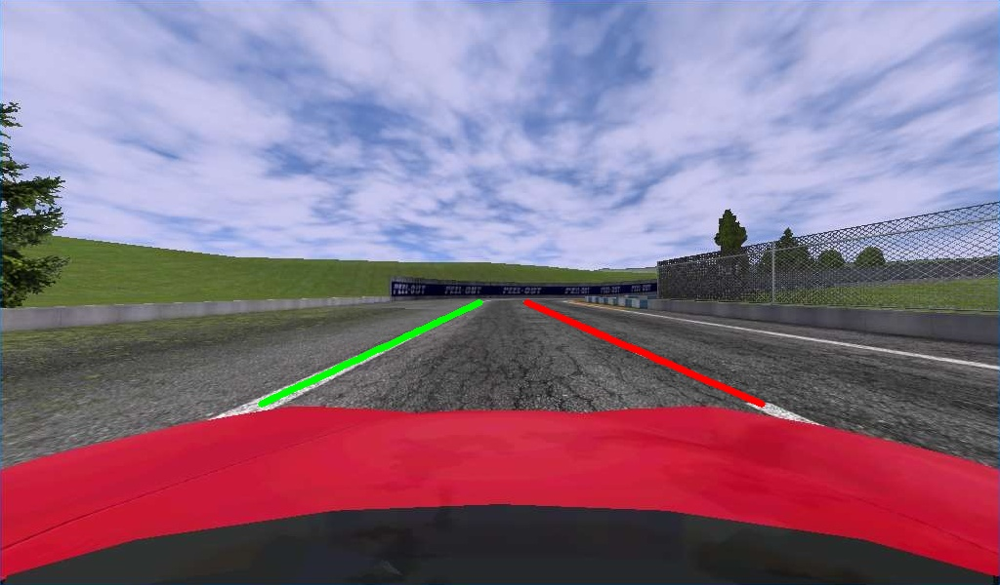
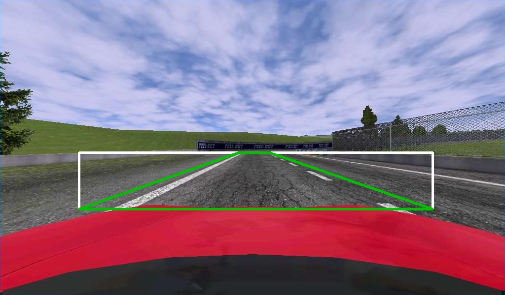
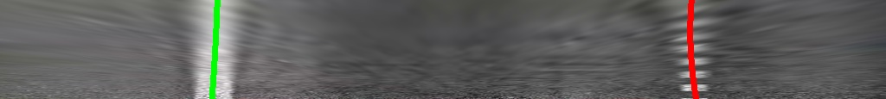

# Detect Lanes
Detect the lanes on a road using Computer Vision

## Perspective
The first step is computing the values for the perspective correction. We can "Warp" the area of the road that we are analyzing, to obtain a "bird's-eye view"

### Original Image

### Perspective Image

### Warped Image

